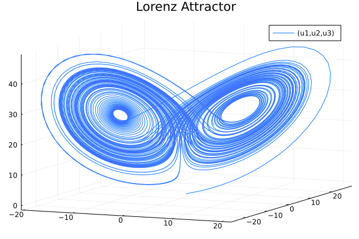
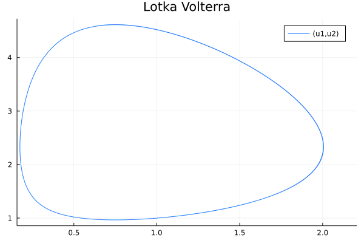

# Motivation
For this script we aim to generate data from different dynamical system equations such as the Lorenz Attractor and Lotka Volterra to test
the different tasks. The folder ```examples``` of our git repository contains the files (ex. ```lorenz.jl```) that define the models. Each file has a function ```datagen()``` that uses the Julia library ```DifferentialEquations.jl``` to define and solve an ODE problem from the equations of the dynamical system and chosen parameters and initial conditions. After solving the problem, we plot and display the solution.

# Lorenz Attractor

The first dynamical system that we implement is the Lorenz Attractor. It is defined by the following equations:
<p style = "text-align: center;"> $\frac{dx}{dt} = \sigma(y-x),$ </p>
<p style = "text-align: center;"> $\frac{dy}{dt} =x(\rho -z)-y,$ </p>
<p style = "text-align: center;"> $\frac{dz}{dt} = xy-\beta z.$  </p>

We choose (σ,ρ,β) = (10,28,8/3) and the point (x,y,z) = (1,0,0) as our starting point. We obtain the following plot:

 

# Lotka Volterra

The second example that we introduce is the Lotka–Volterra system, also known as the predator–prey sytsem. It is defined by the following equations:
<p style = "text-align: center;"> $\frac{dx}{dt} = \alpha x - \beta xy,$ </p>
<p style = "text-align: center;"> $\frac{dy}{dt} =\delta xy - \gamma y,$</p>

where :

- $x$ is the number of prey (for example, rabbits);
- $y$ is the number of some predator (for example, foxes);
- $\frac{dx}{dt}$ and $\frac{dy}{dt}$ represent the instantaneous growth rates of the two populations; 
- t represents time;
- $\alpha, \beta, \gamma, \delta$ are positive real parameters describing the interaction of the two species.

We choose $(\alpha, \beta, \gamma, \delta) = (0.7, 0.3, 0.3, 0.4)$ and the point $(x, y) = (1, 1)$ as our starting point. We obtain the following result: 

 


